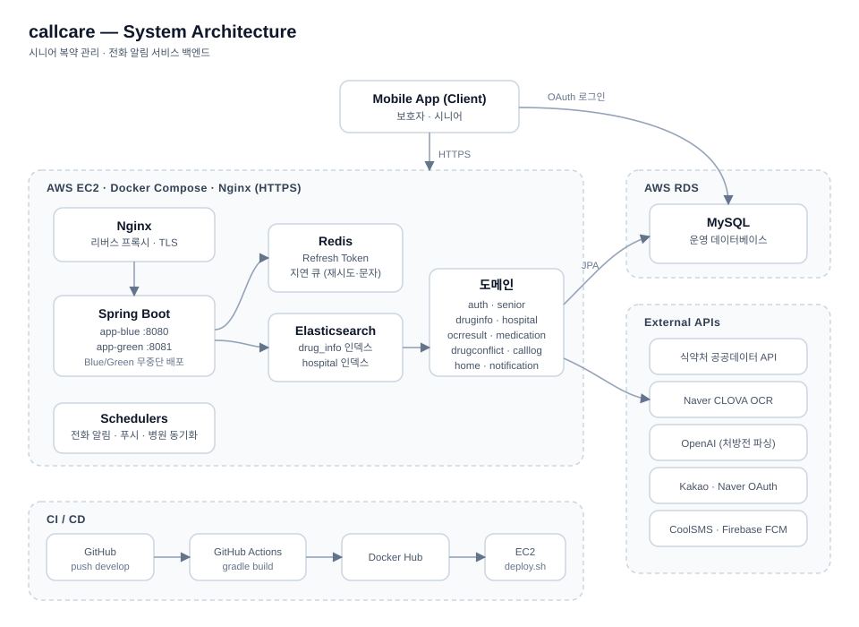

# 콜케어(callcare) Backend

**부모님의 복약을 대신 챙기는 시니어 복약 관리 · 전화 알림 서비스, 콜케어의 백엔드 서버입니다.**

<br/>


[](https://github.com/PIUDAProject/Backend/actions/workflows/deploy.yml)

<div align="center">


</div>

<br/>

## 📌 목차

- [프로젝트 소개](#-프로젝트-소개)
- [주요 기능](#-주요-기능)
- [기술 스택](#-기술-스택)
- [시스템 아키텍처](#-시스템-아키텍처)
- [프로젝트 구조](#-프로젝트-구조)
- [시작하기](#-시작하기)
- [환경 변수](#-환경-변수)
- [API 문서](#-api-문서)
- [커밋 컨벤션](#-커밋-컨벤션)
- [팀원 소개](#-팀원-소개)

<br/>

## 💊 프로젝트 소개

콜케어는 **떨어져 사는 부모님의 복약을 보호자가 대신 관리**할 수 있게 돕는 서비스입니다.

보호자가 처방전·약봉투를 촬영하면 OCR로 약 정보가 자동 입력되고,
식사 시간에 맞춰 부모님께 **전화로 복약을 안내**합니다.
전화를 받지 않으면 재시도 후 보호자와 부모님 모두에게 문자로 알립니다.

```
처방전 촬영 · OCR  →  복약 스케줄 자동 생성  →  식사 시간 전화 알림  →  복약 기록 · 리포트
```

<br/>

## ✨ 주요 기능

**🔐 인증 / 온보딩**
- 카카오 · 네이버 OAuth2 소셜 로그인
- JWT + Redis 기반 Refresh Token 관리
- 부모님(시니어) 프로필 등록, 전화번호 SMS 인증
- 온보딩 완료 시 vCard 생성 후 부모님 번호로 발송

**📷 약 등록 / OCR**
- 처방전 · 약봉투 · 약곽 촬영 → Naver CLOVA OCR 분석 → 약 정보 자동 입력
- 좌표 기반 표 처방전 파싱 + OpenAI(gpt-4o) LLM 하이브리드 파싱
- 약 이름 검색 기반 직접 등록 (Elasticsearch 자동완성)
- 복용 횟수(1일 1~5회) 기반 아침 / 점심 / 저녁 스케줄 자동 생성
- 식약처 용법·보관법 데이터로 메모장 자동 생성

**📞 전화 알림**
- 식사 시간 30분 후 자동 발신 (아침 / 점심 / 저녁 독립)
- 미수신 시 10분 후 1회 재시도 → 그래도 미수신이면 보호자 · 부모님께 문자
- 전화 정상 수신 시 해당 시간대 복약 카드 자동 완료 처리

**🏠 홈 / 복약 관리**
- 주간 캘린더 기반 오늘 / 내일 / 어제 약 대시보드
- 병원별로 그룹화된 복약 카드, 시간대 단위 복약 완료 체크
- 복약 부족(잔여 ≤ 3일) 알림 카드, 알림 센터

**📒 약물 노트**
- 처방 날짜 · 병원 이중 그룹화 목록
- 약 별명 / 실제 약 이름 / 병원명 검색, 날짜 필터(1주~1년)
- 약 상세: 주의사항 · 부작용 · 용법용량 · 효능효과
- 기존 약 정보를 프리필한 재등록 원클릭, 수정 · 소프트 삭제

**📊 약물 리포트**
- 최근 90일 복약 이력, 동일 기관 연속 처방 기간 합산
- 약물 충돌 분석 (식약처 상호작용 데이터 기반), 위험 조합 탐지
- 복약 기록 리포트 (병원별 그룹화)
- PDF 다운로드 🚧 *구현 예정*

**🔔 푸시 알림**
- 약 소진 예정 · 약물 충돌 위험 시 Firebase FCM 푸시
- 재시도 · 문자 발송용 Redis 지연 큐

**🔍 검색**
- Elasticsearch 약품 인덱스(`drug_info`) · 병원 인덱스(`hospital`)
- `match_phrase_prefix` 기반 자동완성
- 앱 기동 시 식약처 공공데이터(약 4,700건) MySQL 캐싱 후 색인

**🤖 챗봇** 🚧 *구현 예정*
- 등록 약 조회, 증상 기반 일반의약품 추천, 부작용 탐색

<br/>

## 🛠 기술 스택

| Category | Stack |
|----------|-------|
| Language | Java 17 |
| Framework | Spring Boot 3.5.14, Spring Security, Spring Data JPA |
| Database | MySQL 8.4 (AWS RDS) |
| Cache / Queue | Redis 7.2 (Refresh Token, 지연 큐) |
| Search | Elasticsearch 8.18 (`drug_info`, `hospital` 인덱스) |
| Auth | JWT (jjwt), OAuth2 (Kakao, Naver), Spring Cloud OpenFeign |
| OCR | Naver CLOVA OCR + 좌표 기반 표 파싱 |
| AI | OpenAI API (gpt-4o) — 처방전 파싱 보정 |
| 공공데이터 | 식약처 의약품 개요 API, HIRA 병원 정보 API |
| 알림 | CoolSMS / Solapi (문자), Firebase Admin SDK (FCM 푸시) |
| Scheduling | Spring `@Scheduled` (전화 알림 재시도, 푸시, 병원 동기화) |
| Infra | AWS EC2 · RDS, Docker Compose, Nginx (Blue/Green 무중단 배포) |
| CI/CD | GitHub Actions → Docker Hub → EC2 |
| Docs | Swagger (springdoc-openapi) |
| Etc | CodeRabbit (AI 코드 리뷰) |

<br/>

## 🏗 시스템 아키텍처

<div align="center">
  
</div>

<br/>

**인프라 요약**
- **Nginx**: 리버스 프록시, HTTPS 종단 처리, Blue/Green upstream 전환
- **Spring Boot**: `app-blue`(8080) / `app-green`(8081) 무중단 교대 배포
- **Redis**: Refresh Token 저장, 전화 재시도 · 문자 발송용 지연 큐
- **Elasticsearch**: 약품 · 병원 검색 인덱스 (기동 시 자동 색인)
- **MySQL** (AWS RDS): 운영 데이터베이스
- **External**: Naver CLOVA OCR, OpenAI, 식약처 · HIRA 공공 API, CoolSMS, Firebase FCM

**CI/CD 흐름**
```
IntelliJ IDEA  →  GitHub (develop push)  →  GitHub Actions  →  Docker Hub  →  EC2 (deploy.sh Blue/Green)
```
> ⚠️ `develop` 브랜치 push 시 `.github/workflows/deploy.yml`가 실행되어 운영 서버까지 자동 배포됩니다.

<br/>

## 📁 프로젝트 구조

```
src/main/java/com/piuda/callcare/
├── domain/
│   ├── auth/             # 카카오·네이버 OAuth2, JWT 발급
│   ├── user/             # 보호자 계정
│   ├── senior/           # 부모님(시니어) 프로필, SMS 인증, vCard
│   ├── druginfo/         # 식약처 의약품 데이터 캐싱 + 검색(ES)
│   ├── drugconflict/     # 약물 상호작용 충돌 분석
│   ├── hospital/         # 병원 정보(HIRA) 캐싱 + 검색(ES)
│   ├── ocrresult/        # CLOVA OCR 연동, 좌표 기반 표 파싱, LLM 보정
│   ├── medication/       # 약 등록, 복약 스케줄 자동 생성, 약물 노트
│   ├── medicationlog/    # 복약 완료 기록
│   ├── medicationreport/ # 복약 리포트
│   ├── calllog/          # 전화 알림 발신·재시도, 결과 webhook
│   ├── home/             # 홈 대시보드, 복약 카드, 소진 알림
│   ├── notification/     # 알림 센터, FCM 푸시, 지연 큐
│   └── fcmtoken/         # FCM 디바이스 토큰 관리
└── global/
    ├── common/           # 공통 응답(ApiResponse), BaseEntity
    ├── config/           # Security, CORS, Redis, Swagger, WebClient, SMS, FCM, 색인 초기화
    ├── security/jwt/      # JWT 필터, 토큰 provider
    ├── exception/        # CallCareException, ErrorCode, GlobalExceptionHandler
    └── util/
```

도메인 서비스는 **CQRS 패턴**으로 `command`(쓰기) / `query`(읽기)를 분리합니다.

<br/>

## 🚀 시작하기

### 사전 요구사항

```bash
java --version    # 17
docker --version  # Docker & Compose
```

### 로컬 실행

```bash
# 1. 클론
git clone https://github.com/PIUDAProject/Backend.git
cd Backend

# 2. 인프라 기동 (MySQL 8.4 / Elasticsearch 8.18 / Redis 7.2)
docker-compose up -d

# 3. 환경 변수 설정 — 프로젝트 루트에 .env 생성 (아래 표 참고)

# 4. 실행
chmod +x ./gradlew
./gradlew bootRun --args='--spring.profiles.active=local'
```

> 최초 기동 시 식약처 의약품 데이터(약 4,700건)를 MySQL에 적재하고 Elasticsearch에 색인하므로 첫 부팅은 다소 느릴 수 있습니다. 이후 기동은 건수가 일치하면 재색인을 생략합니다.

### 테스트

```bash
./gradlew test                        # 단위 테스트 (통합 테스트 제외)
./gradlew test -Dgroups=integration   # 통합 테스트만 (Testcontainers)
```

### 프로덕션 빌드

```bash
./gradlew clean build -x test
java -jar build/libs/callcare-0.0.1-SNAPSHOT.jar --spring.profiles.active=prod
```

<br/>

## 🔧 환경 변수

프로젝트 루트에 `.env` 파일을 생성합니다. (`application*.yml`이 `optional:file:.env` 로 로드)

| Key | 설명 |
|-----|------|
| `LOCAL_DB_URL` / `LOCAL_DB_USERNAME` / `LOCAL_DB_PASSWORD` | 로컬 MySQL 접속 정보 |
| `LOCAL_ES_URI` | 로컬 Elasticsearch URI (예: `http://localhost:9200`) |
| `PROD_DB_URL` / `PROD_DB_USERNAME` / `PROD_DB_PASSWORD` | 운영 MySQL 접속 정보 |
| `PROD_ES_URI` | 운영 Elasticsearch URI |
| `SPRING_DATA_REDIS_HOST` / `SPRING_DATA_REDIS_PORT` | Redis 호스트 / 포트 (기본 `localhost:6379`) |
| `JWT_SECRET` | JWT 서명 시크릿 (256bit 이상) |
| `KAKAO_CLIENT_ID` / `KAKAO_CLIENT_SECRET` / `KAKAO_REDIRECT_URI` | 카카오 OAuth |
| `NAVER_CLIENT_ID` / `NAVER_CLIENT_SECRET` / `NAVER_REDIRECT_URI` | 네이버 OAuth |
| `NAVER_OCR_INVOKE_URL` / `NAVER_OCR_SECRET_KEY` | Naver CLOVA OCR |
| `OPENAI_API_KEY` / `OPENAI_BASE_URL` / `OPENAI_MODEL` | OpenAI (기본 모델 `gpt-4o`) |
| `COOLSMS_API_KEY` / `COOLSMS_API_SECRET` / `COOLSMS_SENDER_NUMBER` | 문자 발송 (CoolSMS / Solapi) |
| `COOLSMS_MOCK_ENABLED` | 문자 실제 발송 여부 (`true`면 목킹) |
| `HIRA_SERVICE_KEY` / `HIRA_HOSPITAL_BASE_URL` | 병원 정보 공공데이터 API |
| `FCM_SERVICE_ACCOUNT_KEY_PATH` | Firebase 서비스 계정 키 파일 경로 |
| `NOTIFICATION_DELAYED_QUEUE_POLLER_ENABLED` / `..._POLL_INTERVAL_MS` | 지연 큐 폴러 설정 |

<br/>

## 📄 API 문서

서버 실행 후 Swagger UI에서 전체 API를 확인할 수 있습니다.

```
http://localhost:8080/swagger-ui/index.html
```

<br/>

## 📝 커밋 컨벤션

```
feat     : 새로운 기능
fix      : 버그 수정
refactor : 코드 리팩토링
docs     : 문서 수정
chore    : 빌드 / 설정
test     : 테스트
```

- 커밋 본문은 한글로 작성하고, 기술 용어(DTO, OCR, ES, JWT 등)는 영어 그대로 사용합니다.
- 브랜치: `feature/{이슈번호}`, `fix/{이슈번호}`, `hotfix/{내용}`
- `develop` 에서 분기 → 작업 후 `develop` 으로 PR (리뷰어 지정 필수)

```bash
# 예시
feat: 전화 미수신 시 보호자·부모님 문자 발송 구현
fix: 약물 노트 검색 병원 그룹화 오류 수정
```

<br/>

## 👥 팀원 소개

<table align="center">
  <tr>
     <td align="center" width="160">
      <a href="https://github.com/marshmallowing">
        
      </a>
      <br/>
      <a href="https://github.com/marshmallowing"><b>정유진</b></a>
      <br/>
      <sub>Backend Developer</sub>
    </td>
    <td align="center" width="160">
      <a href="https://github.com/kangcheolung">
        
      </a>
      <br/>
      <a href="https://github.com/kangcheolung"><b>강철웅</b></a>
      <br/>
      <sub>Backend Developer</sub>
    </td>
    <td align="center" width="160">
      <a href="https://github.com/neibler">
        
      </a>
      <br/>
      <a href="https://github.com/neibler"><b>조형준</b></a>
      <br/>
      <sub>Backend Developer</sub>
    </td>
  </tr>
</table>

<br/>
